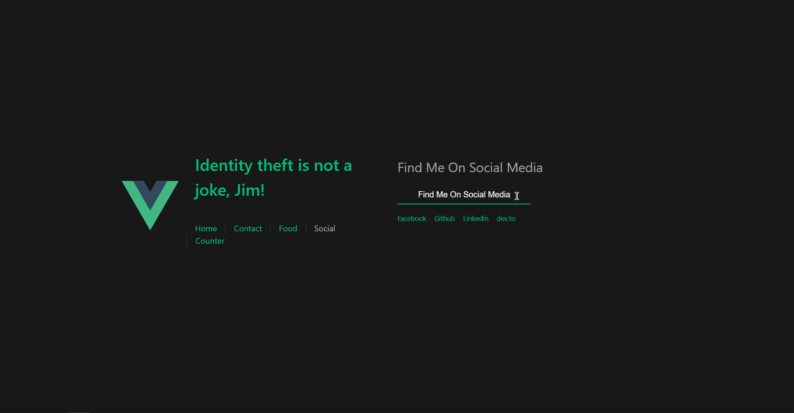
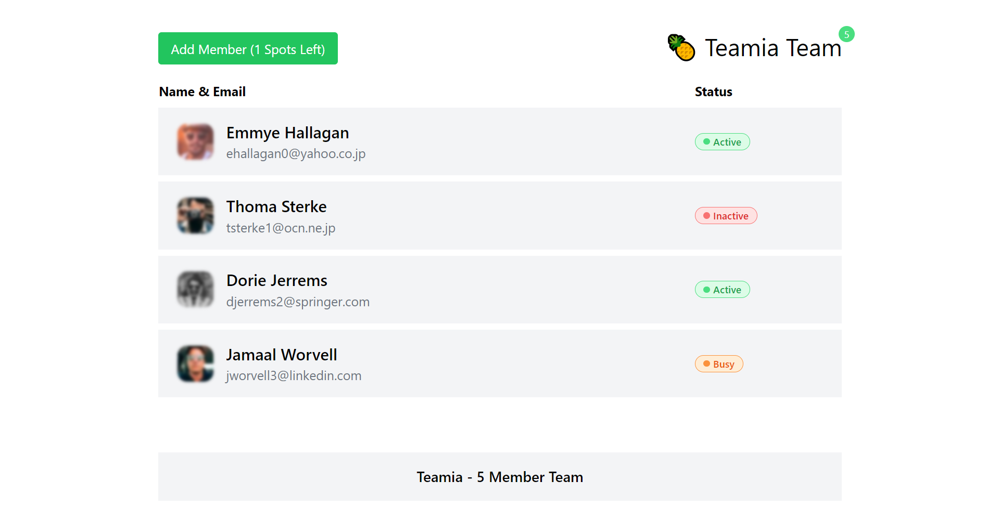
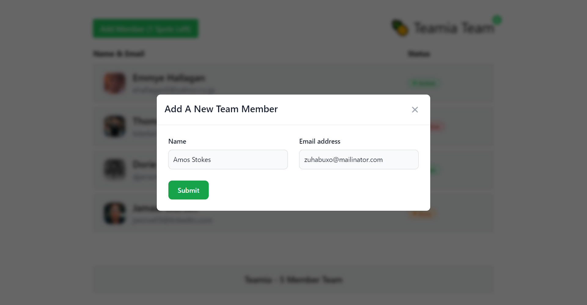

# Vuester

_`vuecli/` : Installing Vue Using CLI, Vue Router, Composition API and more..._

_`teamia/` : Overview of Teamia Dashboard_

_`teamia/` : Reusable Modal in Teamia Project_

My delightful journey of learning Vue.js has began. Here it is, my personal Vue.js practice playground! where I'll be learning & playing with Vue.js, then leave the traces in this repository 😄 haha !

Started learning Vue 3 step by step from [Laracasts](https://laracasts.com/series/learn-vue-3-step-by-step)

Date Started: 1:15 PM, Tuesday, 18 Oct - 2022 | Dhaka, Bangladesh :bd:

Goodluck to myself 🍀

### Finally, it's over!

(10:30 PM | Thursday, 26 Jan 2023)
It was an exciting adventurous journey following along with Jeffrey Way the whole time, and finding answers to many related unknown questions!

Thank you, [Laracasts](https://laracasts.com) for such an initiative 👐🏼 I enjoyed building those fun little practice projects, that helped me deep dive into Vue 3. I wonder how it all started with simple Options API then we moved to Composition API and much more.
Miles to Go ✨

## My Next Goal

- Build 1-2 complete projects using Vue 3 Composition API, Pinia, Vue Router

- Proceed to learn Nuxt.js and Vuetify. Maybe I'm gonna go for Vuetify first. Who knows? Vuetify is just a UI framework on top of Vue. But Nuxt.js is a complete thing though it's a framework of framework 😉

- Collaborate my Vue 3, NuxtJs and related skills and knowledge with Laravel, InertiaJs

Best of luck to me 👏🏼
